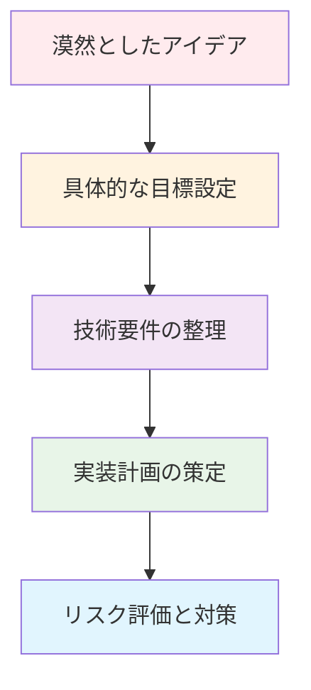

# 作りたいものをAIに相談しよう

本格的なアプリケーション開発を始める前に、まずはAIと効果的に相談してプロジェクトを企画する方法を学びましょう。適切な相談方法を身につけることで、より良いアプリケーションを効率的に開発できるようになります。

## 学習目標

- AIとの効果的な相談方法を習得する
- プロジェクト企画のベストプラクティスを理解する
- 要件定義の質を向上させる技術を学ぶ
- アイデアから実装可能な仕様への変換方法を身につける

## なぜAIに相談するのか

### 従来のプロジェクト企画の課題

- **アイデアの具体化が困難**: 漠然としたアイデアを形にできない
- **技術選択の迷い**: 最適な技術スタックが分からない
- **要件の抜け漏れ**: 重要な機能や制約を見落とす
- **実現可能性の判断**: 技術的な実現可能性が不明

### AIを活用する利点

- **多角的な視点**: 様々な観点からのアドバイス
- **豊富な知識**: 最新技術トレンドと実装パターン
- **即座のフィードバック**: リアルタイムでの相談と改善
- **客観的な評価**: 感情に左右されない技術的判断

## 効果的なAI相談の基本原則

### 1. 段階的なアプローチ



### 2. 明確な情報提供

**良い相談例**:
```
タスク管理アプリを作りたいです。

対象ユーザー: 小規模チーム（5-10人）
主要機能: タスク作成、割り当て、進捗管理、通知
技術制約: Webアプリ、レスポンシブ対応必須
期間: 2ヶ月程度
```

**悪い相談例**:
```
何か便利なアプリを作りたいです。
```

### 3. 具体的な質問

- **What（何を）**: 作りたいものの具体的な内容
- **Who（誰が）**: 対象ユーザーと利用シーン
- **Why（なぜ）**: 解決したい問題と価値
- **How（どのように）**: 技術的な制約と要望
- **When（いつまでに）**: 開発期間と優先度

## ステップ1: アイデアの整理と相談準備

### 1.1 アイデアの書き出し

まず、作りたいもののアイデアを整理しましょう：

```
以下の質問に答えて、アイデアを整理してください：

1. どんなアプリを作りたいですか？
2. なぜそのアプリが必要だと思いますか？
3. 誰が使うことを想定していますか？
4. 似たようなアプリで知っているものはありますか？
5. どんな機能があると嬉しいですか？
```

### 1.2 初回相談の実践

Kiroのチャットで以下のように相談してみましょう：

```
新しいWebアプリケーションのアイデアについて相談したいです。

アイデア: [あなたのアイデア]
目的: [解決したい問題]
対象ユーザー: [想定ユーザー]
期間: [開発期間]

このアイデアについて、以下の観点からアドバイスをください：
1. 実現可能性
2. 技術選択
3. 必要な機能
4. 潜在的な課題
```

### 1.3 AIからのフィードバック活用

AIからの回答を基に、さらに詳しく相談：

```
ありがとうございます。特に[具体的な点]について詳しく教えてください。

また、以下の点も気になります：
- [技術的な疑問]
- [実装上の懸念]
- [ユーザビリティの観点]
```

## ステップ2: 要件定義の深掘り

### 2.1 機能要件の整理

AIと一緒に機能要件を整理：

```
このアプリに必要な機能を整理したいです。

以下の観点から機能を分類してください：
1. 必須機能（MVPに含めるべき）
2. 重要機能（早期に実装したい）
3. 拡張機能（将来的に追加したい）

各機能について、実装の難易度も教えてください。
```

### 2.2 非機能要件の検討

技術的な要件も相談：

```
非機能要件についても相談したいです：

1. パフォーマンス要件（応答時間、同時ユーザー数）
2. セキュリティ要件（認証、データ保護）
3. 可用性要件（稼働時間、障害対応）
4. 拡張性要件（将来の機能追加、ユーザー増加）

これらの要件を満たすための技術選択を提案してください。
```

### 2.3 制約条件の明確化

制約条件も整理：

```
プロジェクトの制約条件を整理したいです：

技術的制約:
- 使用可能な技術スタック
- 開発環境の制限
- 既存システムとの連携要件

ビジネス制約:
- 予算の制限
- 開発期間
- チームのスキルレベル

これらの制約を考慮した実装方針を提案してください。
```

## ステップ3: 技術選択の相談

### 3.1 技術スタックの検討

適切な技術選択について相談：

```
このプロジェクトに最適な技術スタックを提案してください。

要件:
- [機能要件のサマリー]
- [非機能要件のサマリー]
- [制約条件のサマリー]

以下の観点から比較検討してください：
1. 開発効率
2. 学習コスト
3. 保守性
4. 拡張性
5. コミュニティサポート
```

### 3.2 アーキテクチャの相談

システム全体の設計について：

```
システムアーキテクチャについて相談したいです。

以下の点を考慮した設計を提案してください：
1. フロントエンドとバックエンドの分離
2. データベース設計
3. API設計
4. 認証・認可の仕組み
5. デプロイメント戦略

図解があると理解しやすいです。
```

### 3.3 開発環境の設定

開発環境についても相談：

```
効率的な開発環境を構築したいです。

以下について提案してください：
1. 開発ツールの選択
2. CI/CDパイプライン
3. テスト戦略
4. コード品質管理
5. チーム開発のワークフロー
```

## ステップ4: リスク評価と対策

### 4.1 技術的リスクの特定

潜在的なリスクを相談：

```
このプロジェクトの技術的リスクを評価してください。

以下の観点から分析してください：
1. 技術的な実現困難性
2. パフォーマンスの問題
3. セキュリティの脆弱性
4. 拡張性の制限
5. 保守性の課題

各リスクの対策も提案してください。
```

### 4.2 プロジェクトリスクの検討

プロジェクト全体のリスク：

```
プロジェクト管理の観点からリスクを評価してください：

1. スケジュールリスク
2. リソースリスク
3. 品質リスク
4. 要件変更リスク

リスク軽減策も含めて提案してください。
```

### 4.3 代替案の検討

リスク対策として代替案も相談：

```
主要なリスクに対する代替案を検討したいです：

1. 技術選択の代替案
2. 機能実装の代替案
3. アーキテクチャの代替案

各代替案のメリット・デメリットを教えてください。
```

## ステップ5: 実装計画の策定

### 5.1 開発フェーズの分割

段階的な開発計画を相談：

```
このプロジェクトを段階的に開発したいです。

以下のフェーズに分けて計画を立ててください：
1. MVP（最小実行可能製品）
2. 機能拡張フェーズ
3. 最適化フェーズ

各フェーズの目標と成果物を明確にしてください。
```

### 5.2 優先順位の決定

機能の優先順位について：

```
機能の実装優先順位を決めたいです。

以下の基準で評価してください：
1. ユーザー価値の高さ
2. 実装の容易さ
3. 他機能への影響度
4. リスクの大きさ

優先順位マトリックスで整理してください。
```

### 5.3 マイルストーンの設定

具体的なマイルストーン：

```
開発マイルストーンを設定したいです。

以下の情報を含めて提案してください：
1. 各マイルストーンの目標
2. 完了条件
3. 必要な期間
4. 成果物
5. 次フェーズへの条件
```

## ステップ6: プロトタイプの企画

### 6.1 プロトタイプの範囲

検証用プロトタイプについて：

```
アイデアを検証するためのプロトタイプを作りたいです。

以下について提案してください：
1. プロトタイプに含める機能
2. 実装方法（モックアップ vs 動作するプロトタイプ）
3. 検証したい仮説
4. 評価方法
```

### 6.2 ユーザーテストの計画

プロトタイプのテスト計画：

```
プロトタイプのユーザーテストを計画したいです。

以下の計画を立ててください：
1. テスト対象ユーザー
2. テストシナリオ
3. 評価指標
4. フィードバック収集方法
```

## 実践例: タスク管理アプリの企画

### 実際の相談例

```
チーム向けタスク管理アプリを作りたいです。

背景:
現在のツールでは、タスクの依存関係が見えにくく、
チーム全体の進捗把握が困難です。

目標:
- タスクの依存関係を視覚化
- リアルタイムな進捗共有
- 簡単な操作性

対象: 5-10人の開発チーム
期間: 3ヶ月

このアイデアについて、実現可能性と技術選択を相談したいです。
```

### AIからの回答例

```
素晴らしいアイデアですね！以下の観点から分析します：

実現可能性: ★★★★☆
- 基本機能は十分実現可能
- 依存関係の視覚化は技術的に挑戦的だが実装可能

推奨技術スタック:
- フロントエンド: React + D3.js（依存関係の視覚化）
- バックエンド: Node.js + Express
- データベース: PostgreSQL
- リアルタイム通信: Socket.io

主要な課題:
1. 依存関係の複雑な表示
2. リアルタイム同期の実装
3. 大量データでのパフォーマンス

次のステップ:
まずは簡単なプロトタイプで依存関係の表示方法を検証することをお勧めします。
```

## 相談の質を向上させるコツ

### 1. 具体的な情報を提供

- **良い例**: 「5人チームで使う、Slackと連携するタスク管理アプリ」
- **悪い例**: 「便利なアプリ」

### 2. 制約条件を明確に

- 技術的制約（使用可能な技術、既存システム）
- 時間的制約（開発期間、リリース予定）
- リソース制約（チームサイズ、予算）

### 3. 段階的に深掘り

- 最初は概要を相談
- 詳細は段階的に深掘り
- 各段階で理解を確認

### 4. 代替案を求める

- 複数の選択肢を比較検討
- メリット・デメリットを理解
- リスクと対策を考慮

## よくある相談パターン

### パターン1: 既存サービスの改良版

```
「〇〇のようなサービスだけど、△△の機能を追加したい」

相談のポイント:
- 既存サービスとの差別化要素
- 追加機能の技術的実現性
- 競合優位性の確保方法
```

### パターン2: 業務効率化ツール

```
「現在の業務を効率化するツールを作りたい」

相談のポイント:
- 現在の業務フローの分析
- 効率化のボトルネック特定
- ROI（投資対効果）の評価
```

### パターン3: 新しいアイデアの検証

```
「こんなアイデアがあるけど、需要があるか分からない」

相談のポイント:
- 市場調査の方法
- MVP（最小実行可能製品）の定義
- 仮説検証の手法
```

## まとめ

効果的なAI相談により：

1. **アイデアの具体化**: 漠然としたアイデアを実装可能な仕様へ変換
2. **技術選択の最適化**: 要件に最適な技術スタックの選択
3. **リスクの早期発見**: 潜在的な問題の事前特定と対策
4. **実装計画の策定**: 段階的で実現可能な開発計画

> 📖 **公式ドキュメント**: Kiroの最新機能については [kiro.dev/docs](https://kiro.dev/docs/) を参照してください

次のセクションでは、実際にMCPを設定して外部サービスとの連携を実現する方法を学習します。

---

## 📚 学習進捗チェック

このセクションを完了したら、以下の項目ができるようになっているか確認してください：

- [ ] AIとの効果的な相談方法を理解している
- [ ] プロジェクト企画の基本的な流れを把握している
- [ ] 要件定義の質を向上させる技術を身につけている
- [ ] アイデアから実装可能な仕様への変換ができる
- [ ] リスク評価と対策の考え方を理解している

---

<div align="center">

| [← 🧪 Playwright MCP](../chapter1/playwright-mcp-testing.md) | [🏠 目次](../../README.md) | [⚙️ AWS MCP設定 →](aws-mcp-setup.md) |
|:---:|:---:|:---:|

</div>

---

### 🔗 関連リソース
- [📋 Steering設計原則](steering-design-principles.md)
- [🏗️ パターン言語解説](pattern-language.md)
- [🛠️ トラブルシューティング](../troubleshooting/common-issues.md)