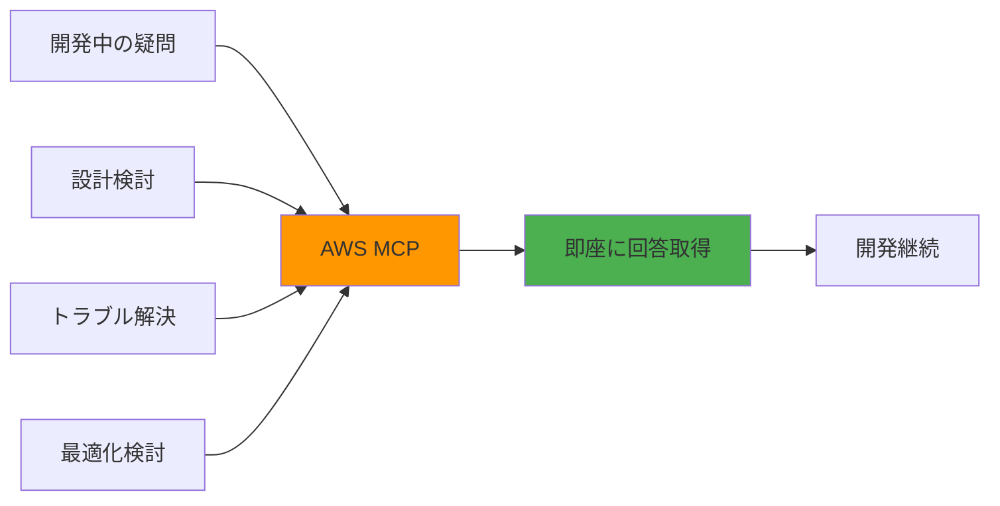

# MCPを設定しよう > AWSドキュメント系

本格的なクラウドアプリケーション開発では、AWSサービスの豊富な機能を活用することが重要です。このセクションでは、AWS Documentation MCPを設定して、Kiro内でAWSサービスの情報を効率的に活用する方法を学びます。

## 学習目標

- AWS Documentation MCPの概念と利点を理解する
- MCP設定ファイルの作成と管理方法を習得する
- AWSサービス情報の効率的な活用方法を学ぶ
- トラブルシューティングスキルを身につける

## AWS Documentation MCPとは

### 概要

**AWS Documentation MCP**は、AWS公式ドキュメントの情報をKiro内で直接参照できるようにするMCPサーバーです。これにより、開発中にブラウザを切り替えることなく、必要なAWS情報を即座に取得できます。

### 主な機能

- **サービス検索**: AWSサービスの概要と機能を検索
- **API リファレンス**: 各サービスのAPI仕様を参照
- **ベストプラクティス**: 推奨される実装パターンの取得
- **料金情報**: サービスの料金体系の確認
- **制限事項**: 各サービスの制限と注意点の把握

### 利用シーン



## ステップ1: 前提条件の確認

### 1.1 必要なツールの確認

AWS Documentation MCPを使用するために必要なツール：

```bash
# Python環境の確認
python --version
# Python 3.8以上が必要

# uvの確認（Pythonパッケージマネージャー）
uv --version
# インストールされていない場合は以下でインストール
curl -LsSf https://astral.sh/uv/install.sh | sh
```

### 1.2 uvxの確認

uvxはuvに含まれるツールで、MCPサーバーの実行に使用します：

```bash
# uvxの動作確認
uvx --help
```

> 💡 **重要**: `uvx`は`uv`に含まれているため、`uv`をインストールすれば自動的に使用できます。`uvx install <package>`のようなコマンドは存在しません。`uvx`は指定されたパッケージを自動的にダウンロードして実行します。

### 1.3 Kiroの設定フォルダ確認

MCP設定ファイルを配置するフォルダを確認：

```bash
# ワークスペース設定フォルダ
ls -la .kiro/settings/

# ユーザー設定フォルダ（存在しない場合は作成される）
ls -la ~/.kiro/settings/
```

> 💡 **設定の優先順位**: 両方の設定ファイルが存在する場合、設定はマージされ、ワークスペースレベルの設定が優先されます（サーバー名が競合する場合）。つまり、期待されるMCPサーバーがワークスペースに定義されていない場合、ユーザーレベルで定義されている可能性があります。

## ステップ2: MCP設定ファイルの作成

### 2.1 ワークスペース設定の作成

プロジェクト固有の設定として、ワークスペースレベルでMCPを設定します：

```
Kiroのチャットで以下のように入力してください：

AWS Documentation MCPを設定したいです。
.kiro/settings/mcp.json にAWS Documentation MCPの設定を追加してください。
```

### 2.2 設定ファイルの内容

期待される設定内容：

```json
{
  "mcpServers": {
    "awslabs.aws-documentation-mcp-server": {
      "command": "uvx",
      "args": ["awslabs.aws-documentation-mcp-server@latest"],
      "env": {
        "FASTMCP_LOG_LEVEL": "ERROR",
        "AWS_DOCUMENTATION_PARTITION": "aws"
      },
      "disabled": false,
      "autoApprove": []
    }
  }
}
```

### 2.3 設定の詳細説明

各設定項目の意味：

- **`awslabs.aws-documentation-mcp-server`**: MCPサーバーの識別名（公式パッケージ名を使用）
- **`command`**: 実行コマンド（`uvx`）
- **`args`**: MCPサーバーのパッケージ名とバージョン（`@latest`で最新版を使用）
- **`env`**: 環境変数
  - `FASTMCP_LOG_LEVEL`: ログレベルの設定（`ERROR`, `WARNING`, `INFO`, `DEBUG`）
  - `AWS_DOCUMENTATION_PARTITION`: AWSパーティション（`aws`または`aws-cn`）
- **`disabled`**: サーバーの有効/無効（`true`で無効化、`false`で有効化）
- **`autoApprove`**: 自動承認するツール名のリスト
  - 空の配列`[]`の場合は全て手動承認
  - ツール名を追加すると、そのツールは自動承認される

> 💡 **autoApproveの活用**: 頻繁に使用する安全なツールを`autoApprove`リストに追加することで、開発効率が向上します

> 📖 **公式ドキュメント**: MCPの詳細は [kiro.dev/docs](https://kiro.dev/docs/) を参照してください

## ステップ3: 設定の適用と確認

### 3.1 設定ファイルの確認

作成された設定ファイルを確認：

```bash
# 設定ファイルの内容確認
cat .kiro/settings/mcp.json
```

### 3.2 Kiroでの設定反映

Kiroで設定を反映させる方法：

1. **自動反映**: 設定ファイル変更時に自動的に反映
2. **手動反映**: Kiroを再起動（不要な場合が多い）
3. **MCP Server view**: Kiro内のMCP Server viewから再接続
   - Kiro機能パネルの「MCP Server」ビューを開く
   - 再接続したいサーバーを選択して再接続

> 💡 **便利な機能**: 設定変更時にサーバーは自動的に再接続されるため、通常はKiroを再起動する必要はありません。コマンドパレットから「MCP」を検索して関連コマンドを見つけることもできます。

### 3.3 接続状態の確認

> 💡 **MCPテストのベストプラクティス**: 公式ドキュメントによると、MCP設定後は設定ファイルを確認する前に、直接ツールを試すのが推奨されます。

MCPサーバーが正常に動作しているか確認：

```
Kiroのチャットで以下のように入力して確認してください：

AWS S3について教えてください。
```

MCPが正常に動作していれば、AWS Documentation MCPを使用してS3の情報を取得します。

**利用可能なツール**:
- `read_documentation`: AWSドキュメントページの読み込み
- `search_documentation`: AWSドキュメントの検索（グローバルのみ）
- `recommend`: コンテンツ推奨（グローバルのみ）
- `get_available_services`: 利用可能サービス一覧（中国のみ）

> 📖 **詳細**: MCPの完全な設定ガイドは[機能リファレンス](../features/mcp-configuration.md)を参照してください

## ステップ4: 基本的な使用方法

### 4.1 サービス情報の検索

AWSサービスの基本情報を検索：

```
Amazon S3について教えてください。
主な機能と使用方法を説明してください。
```

### 4.2 API リファレンスの取得

具体的なAPI情報を取得：

```
S3のPutObjectAPIの使用方法を教えてください。
パラメータと応答形式を含めて説明してください。
```

### 4.3 ベストプラクティスの確認

推奨される実装パターンを確認：

```
S3を使用したWebアプリケーションでの
ベストプラクティスを教えてください。
セキュリティとパフォーマンスの観点から説明してください。
```

## ステップ5: 実践的な活用例

### 5.1 アーキテクチャ設計での活用

システム設計時の情報収集：

```
以下の要件を満たすWebアプリケーションのアーキテクチャを設計したいです：

要件：
- ユーザー認証機能
- ファイルアップロード機能
- リアルタイム通知
- 高可用性

適切なAWSサービスの組み合わせを提案してください。
各サービスの役割と連携方法も説明してください。
```

### 5.2 実装時の技術調査

具体的な実装方法の調査：

```
React アプリケーションからS3に直接ファイルをアップロードする方法を教えてください。

以下の点を含めて説明してください：
- 必要な権限設定
- フロントエンドの実装方法
- セキュリティの考慮事項
- エラーハンドリング
```

### 5.3 トラブルシューティング

問題解決時の情報収集：

```
S3へのアップロードで「Access Denied」エラーが発生しています。

考えられる原因と解決方法を教えてください。
IAMポリシーとバケットポリシーの設定例も含めてください。
```

## ステップ6: 高度な活用方法

### 6.1 複数サービスの連携

複雑なシステムでの活用：

```
以下のワークフローを実現するAWSサービスの構成を教えてください：

1. ユーザーがファイルをアップロード
2. 自動的に画像リサイズ処理
3. 処理完了をユーザーに通知
4. 処理結果をデータベースに記録

各ステップで使用するサービスと設定方法を説明してください。
```

### 6.2 コスト最適化

料金効率の良い構成の検討：

```
月間10万リクエスト、1TB のデータ転送があるWebアプリケーションの
コスト最適化を検討したいです。

以下の観点から提案してください：
- 適切なインスタンスタイプ
- ストレージクラスの選択
- CDNの活用
- 予想される月額料金
```

### 6.3 セキュリティ強化

セキュリティベストプラクティスの適用：

```
金融系アプリケーションでAWSを使用する際の
セキュリティ要件と実装方法を教えてください。

以下の要素を含めて説明してください：
- データ暗号化
- アクセス制御
- 監査ログ
- コンプライアンス対応
```

## ステップ7: チーム開発での活用

### 7.1 設定の共有

チーム全体でMCP設定を共有：

```json
// プロジェクトのREADMEに記載する設定例
{
  "mcpServers": {
    "awslabs.aws-documentation-mcp-server": {
      "command": "uvx",
      "args": ["awslabs.aws-documentation-mcp-server@latest"],
      "env": {
        "FASTMCP_LOG_LEVEL": "ERROR",
        "AWS_DOCUMENTATION_PARTITION": "aws"
      },
      "disabled": false,
      "autoApprove": [
        "read_documentation",
        "search_documentation"
      ]
    }
  }
}
```

### 7.2 知識の標準化

チーム内でのAWS知識の統一：

```
チーム開発でAWSを使用する際の標準的な構成を定義したいです。

以下の要素を含む標準構成を提案してください：
- 開発/ステージング/本番環境の分離
- CI/CDパイプライン
- 監視とログ収集
- セキュリティ設定
```

### 7.3 ドキュメント作成支援

技術ドキュメントの作成支援：

```
プロジェクトのAWSアーキテクチャドキュメントを作成したいです。

以下の構成について、図解と説明文を作成してください：
- [現在の構成を記述]

ドキュメントには以下を含めてください：
- システム概要図
- 各サービスの役割
- データフロー
- セキュリティ考慮事項
```

## トラブルシューティング

### よくある問題と解決方法

#### 問題1: MCPサーバーが起動しない

**症状**: 
```
Error: Failed to start MCP server 'awslabs.aws-documentation-mcp-server'
```

**解決方法**:
```bash
# uvとuvxのインストール確認
curl -LsSf https://astral.sh/uv/install.sh | sh
source ~/.bashrc

# MCPサーバーの手動実行テスト
uvx awslabs.aws-documentation-mcp-server@latest

# 設定ファイルの構文確認
cat .kiro/settings/mcp.json | python -m json.tool
```

#### 問題2: ツールが認識されない

**症状**: AWS関連のツールが利用できない

**解決方法**:
```
1. MCP Server viewでサーバーの状態を確認
2. autoApproveリストにツール名が含まれているか確認
3. Kiroを再起動して設定を再読み込み
```

#### 問題3: 応答が遅い

**症状**: AWS情報の取得に時間がかかる

**解決方法**:
```json
// ログレベルを調整
{
  "env": {
    "FASTMCP_LOG_LEVEL": "WARNING"
  }
}
```

#### 問題4: 権限エラー

**症状**: MCPサーバーの実行権限がない

**解決方法**:
```bash
# 実行権限の確認
which uvx
ls -la $(which uvx)

# パスの確認
echo $PATH

# 必要に応じてパスを追加
export PATH="$HOME/.local/bin:$PATH"
```

## 設定のカスタマイズ

### 環境別設定

開発環境に応じた設定の調整：

```json
{
  "mcpServers": {
    "awslabs.aws-documentation-mcp-server": {
      "command": "uvx",
      "args": ["awslabs.aws-documentation-mcp-server@latest"],
      "env": {
        "FASTMCP_LOG_LEVEL": "DEBUG",
        "AWS_DOCUMENTATION_PARTITION": "aws"
      },
      "disabled": false,
      "autoApprove": [
        "read_documentation",
        "search_documentation",
        "recommend"
      ]
    }
  }
}
```

### 複数MCPサーバーとの組み合わせ

他のMCPサーバーとの併用：

```json
{
  "mcpServers": {
    "awslabs.aws-documentation-mcp-server": {
      "command": "uvx",
      "args": ["awslabs.aws-documentation-mcp-server@latest"],
      "env": {
        "FASTMCP_LOG_LEVEL": "ERROR",
        "AWS_DOCUMENTATION_PARTITION": "aws"
      },
      "disabled": false
    },
    "github": {
      "command": "uvx",
      "args": ["mcp-server-github"],
      "disabled": false
    }
  }
}
```

## ベストプラクティス

### 1. 段階的な導入

```
1. 基本的な検索機能から開始
2. よく使用するツールをautoApproveに追加
3. チーム全体での活用方法を標準化
4. 高度な機能の活用を検討
```

### 2. 効率的な質問方法

```
良い質問例：
「Lambda関数でS3イベントを処理する方法を、
コード例とIAM権限設定を含めて教えてください」

悪い質問例：
「Lambdaについて教えて」
```

### 3. 情報の活用

```
- 取得した情報をSteeringファイルに記録
- よく使用するパターンをテンプレート化
- チーム内での知識共有を促進
```

## まとめ

AWS Documentation MCPの設定により：

1. **効率的な情報収集**: 開発中にリアルタイムでAWS情報を取得
2. **正確な実装**: 公式ドキュメントに基づく確実な実装
3. **チーム知識の向上**: 統一された情報源による知識レベルの向上
4. **開発速度の向上**: 調査時間の短縮による開発効率化

次のセクションでは、Steeringファイルを使ってプロジェクト固有の設計原則を定義する方法を学習します。

---

## 📚 学習進捗チェック

このセクションを完了したら、以下の項目ができるようになっているか確認してください：

- [ ] AWS Documentation MCPの概念と利点を理解している
- [ ] MCP設定ファイルの作成と管理ができる
- [ ] AWSサービス情報の効率的な活用ができる
- [ ] 基本的なトラブルシューティングができる
- [ ] チーム開発でのMCP活用方法を理解している

---

<div align="center">

| [← 💡 AI相談](ai-consultation.md) | [🏠 目次](../../README.md) | [📋 Steering設計原則 →](steering-design-principles.md) |
|:---:|:---:|:---:|

</div>

---

### 🔗 関連リソース
- [⚙️ MCP設定テンプレート](../../templates/mcp/)
- [🛠️ トラブルシューティング](../troubleshooting/common-issues.md)
- [❓ FAQ](../troubleshooting/faq.md)