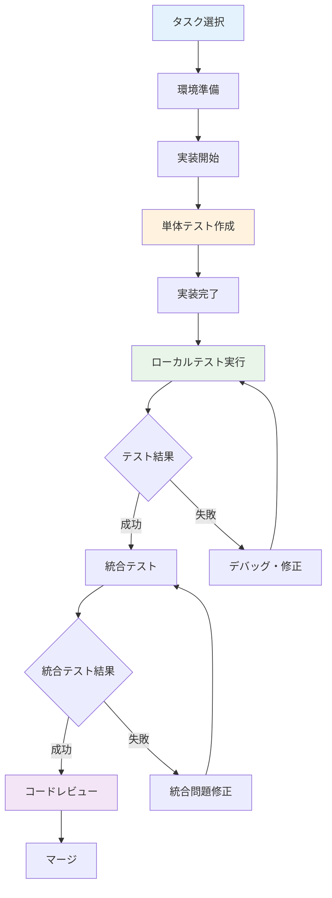

# 実装とテストの実践ガイド

設計が完了したら、いよいよ実装フェーズに入ります。このセクションでは、Kiroを活用した効率的な実装プロセス、継続的なテスト実行、そしてローカル開発環境での効果的な開発サイクルについて学習します。

## 学習目標

- 段階的な実装アプローチを習得する
- ローカル開発環境での効率的な開発サイクルを身につける
- Kiro Hooksを使った自動テスト実行の仕組みを構築する
- テスト駆動開発（TDD）の実践方法を学ぶ

## 実装の基本アプローチ

### 実装フロー



### 実装の原則

- **小さなイテレーション**: 1つの機能を小さく分割して実装
- **テストファースト**: 実装前にテストを作成
- **継続的な検証**: 頻繁なローカル実行とテスト
- **早期統合**: 他の機能との統合を早期に実施

## ステップ1: 開発環境の準備

### 1.1 ローカル開発環境のセットアップ

効率的な開発のための環境構築：

```
Kiroのチャットで以下のように入力してください：

タスク管理アプリの開発環境をセットアップしたいです。

技術スタック：
- フロントエンド: React + TypeScript + Vite
- バックエンド: Node.js + Express + TypeScript
- データベース: PostgreSQL
- テスト: Jest + React Testing Library
- 開発ツール: ESLint + Prettier

以下を含む開発環境を構築してください：
1. プロジェクト初期化
2. 必要なパッケージのインストール
3. 設定ファイルの作成
4. 開発サーバーの起動スクリプト
5. ホットリロード設定
```

### 1.2 データベースのセットアップ

ローカル開発用データベース環境：

```
ローカル開発用のPostgreSQLセットアップを作成してください。

要件：
- Docker Composeを使用
- 開発用とテスト用の分離
- 初期データの投入
- マイグレーション実行
- シードデータの作成

以下のファイルを作成してください：
- docker-compose.yml
- 初期化スクリプト
- マイグレーションファイル
- シードデータ
```

### 1.3 開発ツールの設定

コード品質を保つためのツール設定：

```
開発効率を向上させるツール設定を作成してください。

設定対象：
- ESLint: コード品質チェック
- Prettier: コードフォーマット
- Husky: Git hooks
- lint-staged: ステージされたファイルのチェック
- TypeScript: 型チェック

各ツールの設定ファイルと、package.jsonのスクリプトを作成してください。
```

## ステップ2: 段階的な実装プロセス

### 2.1 最初の機能実装

基本的な機能から開始：

```
ユーザー認証機能を実装したいです。

実装順序：
1. データモデルの定義
2. データベーススキーマの作成
3. APIエンドポイントの実装
4. フロントエンドコンポーネントの作成
5. 統合テストの実装

各ステップで以下を含めてください：
- 実装コード
- 単体テスト
- 型定義
- エラーハンドリング
- ログ出力

段階的に実装し、各ステップで動作確認を行ってください。
```

### 2.2 テスト駆動開発（TDD）の実践

TDDサイクルの実装：

```
ユーザー登録機能をTDDで実装してください。

TDDサイクル：
1. Red: 失敗するテストを書く
2. Green: テストを通す最小限のコードを書く
3. Refactor: コードを改善する

実装対象：
- ユーザー登録API
- バリデーション機能
- パスワードハッシュ化
- 重複チェック

各サイクルでのテストコードと実装コードを段階的に示してください。
```

### 2.3 統合テストの実装

複数のコンポーネントを組み合わせたテスト：

```
認証機能の統合テストを実装してください。

テストシナリオ：
1. ユーザー登録 → ログイン → 認証確認
2. 無効なデータでの登録失敗
3. 間違ったパスワードでのログイン失敗
4. JWTトークンの有効性確認

使用ツール：
- Supertest（API テスト）
- Jest（テストフレームワーク）
- Test Database（テスト用DB）

実際のHTTPリクエストを使った統合テストを作成してください。
```

## ステップ3: ローカル実行と開発サイクル

### 3.1 効率的な開発サーバー運用

開発サーバーの最適な運用方法：

```
効率的な開発サーバー運用のセットアップを作成してください。

要件：
- フロントエンドとバックエンドの同時起動
- ホットリロード対応
- プロキシ設定（CORS対応）
- 環境変数の管理
- ログの統合表示

以下を含むスクリプトを作成してください：
- 開発サーバー起動スクリプト
- 環境変数設定
- プロキシ設定
- ログ設定
```

### 3.2 デバッグ環境の構築

効果的なデバッグのための環境設定：

```
デバッグ環境を構築してください。

デバッグツール：
- VS Code デバッガー設定
- Chrome DevTools連携
- Node.js デバッガー
- React Developer Tools
- Redux DevTools（使用する場合）

設定内容：
- launch.json（VS Code）
- ブレークポイント設定
- ソースマップ設定
- ログレベル設定
- エラー追跡設定

実際のデバッグ手順も含めてください。
```

### 3.3 パフォーマンス監視

開発中のパフォーマンス監視：

```
開発環境でのパフォーマンス監視を設定してください。

監視項目：
- API レスポンス時間
- フロントエンドレンダリング時間
- データベースクエリ時間
- メモリ使用量
- バンドルサイズ

使用ツール：
- webpack-bundle-analyzer
- React Profiler
- Node.js Performance Hooks
- PostgreSQL EXPLAIN

パフォーマンス問題の早期発見と対策方法を含めてください。
```

## ステップ4: Kiro Hooksを使った自動テスト

### 4.1 Kiro Hooksの基本設定

Kiro Hooksは、イベントトリガーによる自動化機能です。ファイル保存時やボタンクリック時にエージェント実行を自動的に開始できます。

**Hooksの設定方法**:
1. エクスプローラービューの「Agent Hooks」セクションから設定
2. コマンドパレットで「Open Kiro Hook UI」を検索して実行

**Hooksの活用例**:
- ファイル保存時にテストを自動実行
- 翻訳ファイル更新時に他言語も自動更新
- 手動トリガーでREADMEのスペルチェック実行

自動テスト実行のためのHooks設定：

```
Kiro Hooksを設定して、ファイル保存時に自動テストを実行したいです。

設定内容：
- ファイル保存時のトリガー
- 変更されたファイルに関連するテストのみ実行
- テスト結果の通知
- 失敗時のエラー表示

対象ファイル：
- TypeScriptファイル（.ts, .tsx）
- テストファイル（.test.ts, .spec.ts）

Hookの設定方法と実行スクリプトを作成してください。
```

> 📖 **詳細**: Hooksの完全ガイドは[機能リファレンス](../features/hooks-guide.md)を参照してください

### 4.2 段階的テスト実行

効率的なテスト実行戦略：

```
段階的なテスト実行Hookを設定してください。

実行段階：
1. 保存時: 関連する単体テストのみ
2. コミット前: 全単体テスト + 静的解析
3. プッシュ前: 統合テスト + E2Eテスト

各段階での実行内容：
- テスト範囲
- 実行時間の目安
- 失敗時の対応
- 通知方法

効率的なテスト実行のための設定を作成してください。
```

### 4.3 テスト結果の可視化

テスト結果の効果的な表示：

```
テスト結果を分かりやすく表示する仕組みを作成してください。

表示内容：
- テスト実行結果サマリー
- カバレッジ情報
- 失敗したテストの詳細
- パフォーマンス情報
- 前回実行との比較

表示方法：
- コンソール出力
- VS Code通知
- HTMLレポート生成
- Slack通知（オプション）

見やすく、アクションしやすい形式で設計してください。
```

## ステップ5: 継続的な品質改善

### 5.1 コード品質メトリクス

コード品質の継続的な監視：

```
コード品質メトリクスの監視システムを構築してください。

監視項目：
- テストカバレッジ
- 循環的複雑度
- 重複コード率
- 技術的負債
- ESLintエラー数

ツール設定：
- Istanbul（カバレッジ）
- SonarJS（品質分析）
- jscpd（重複検出）
- ESLint（静的解析）

品質基準の設定と改善アクションも含めてください。
```

### 5.2 自動リファクタリング

コード改善の自動化：

```
自動リファクタリングの仕組みを構築してください。

対象：
- 未使用コードの削除
- import文の整理
- コードフォーマット
- 型定義の最適化
- 依存関係の整理

実行タイミング：
- ファイル保存時
- コミット前
- 定期実行（週次）

安全性を確保するための検証手順も含めてください。
```

### 5.3 パフォーマンス最適化

継続的なパフォーマンス改善：

```
パフォーマンス最適化の自動化を設定してください。

最適化対象：
- バンドルサイズの最適化
- 画像の最適化
- 不要なライブラリの検出
- メモリリークの検出
- データベースクエリの最適化

監視と改善：
- パフォーマンス回帰の検出
- 最適化提案の自動生成
- ベンチマーク結果の記録
- 改善効果の測定

継続的な改善サイクルを構築してください。
```

## ステップ6: 実践的な開発例

### 6.1 タスク管理機能の実装

実際の機能実装例：

```
タスク管理機能を段階的に実装してください。

機能要件：
- タスクの作成、編集、削除
- ステータス管理（未着手、進行中、完了）
- 優先度設定
- 期限設定
- 担当者割り当て

実装手順：
1. データモデル設計
2. API実装（CRUD）
3. フロントエンドコンポーネント
4. 状態管理
5. テスト実装

各ステップでTDDを実践し、継続的にテストを実行してください。
```

### 6.2 リアルタイム機能の実装

WebSocketを使ったリアルタイム機能：

```
タスクの更新をリアルタイムで同期する機能を実装してください。

技術要件：
- Socket.io使用
- 認証済みユーザーのみ接続
- ルーム機能（プロジェクト別）
- 接続状態の管理
- エラーハンドリング

実装内容：
- サーバーサイド（Socket.io server）
- クライアントサイド（Socket.io client）
- 状態管理との統合
- 接続状態の表示
- オフライン対応

テスト方法も含めて実装してください。
```

### 6.3 認可機能の実装

ロールベースアクセス制御：

```
ロールベースの認可機能を実装してください。

ロール定義：
- Admin: 全権限
- Manager: プロジェクト管理
- Member: タスク操作
- Viewer: 閲覧のみ

実装要素：
- ロール管理システム
- 権限チェックミドルウェア
- フロントエンド権限制御
- 動的メニュー表示
- 監査ログ

セキュリティを考慮した実装を行ってください。
```

## ステップ7: トラブルシューティングとデバッグ

### 7.1 よくある問題と解決方法

開発中によく発生する問題：

#### 問題1: テストが不安定

**症状**: 同じテストが成功したり失敗したりする

**原因と解決方法**:
```typescript
// 問題のあるテスト
test('user creation', async () => {
  const user = await createUser({ name: 'Test User' });
  expect(user.id).toBeDefined(); // IDが非同期で生成される場合、不安定
});

// 改善されたテスト
test('user creation', async () => {
  const userData = { name: 'Test User' };
  const user = await createUser(userData);
  
  expect(user).toMatchObject({
    name: userData.name,
    id: expect.any(String),
    createdAt: expect.any(Date)
  });
});
```

#### 問題2: メモリリーク

**症状**: 長時間実行でメモリ使用量が増加

**解決方法**:
```typescript
// リスナーのクリーンアップ
useEffect(() => {
  const handleResize = () => {
    // リサイズ処理
  };
  
  window.addEventListener('resize', handleResize);
  
  return () => {
    window.removeEventListener('resize', handleResize);
  };
}, []);

// タイマーのクリーンアップ
useEffect(() => {
  const timer = setInterval(() => {
    // 定期処理
  }, 1000);
  
  return () => clearInterval(timer);
}, []);
```

#### 問題3: データベース接続エラー

**症状**: 接続プールの枯渇

**解決方法**:
```typescript
// 接続プールの適切な管理
const pool = new Pool({
  max: 20,
  idleTimeoutMillis: 30000,
  connectionTimeoutMillis: 2000,
});

// 必ずクライアントを解放
const client = await pool.connect();
try {
  const result = await client.query('SELECT * FROM users');
  return result.rows;
} finally {
  client.release();
}
```

### 7.2 デバッグ手法

効果的なデバッグ方法：

```
効果的なデバッグ手法を教えてください。

デバッグ対象：
- API エラー
- フロントエンドの状態管理
- データベースクエリ
- 非同期処理
- メモリリーク

各対象について：
- 問題の特定方法
- デバッグツールの使用方法
- ログの活用方法
- 再現手順の作成方法

実践的なデバッグ例も含めてください。
```

### 7.3 パフォーマンス問題の解決

パフォーマンス問題の診断と解決：

```
パフォーマンス問題の診断と解決方法を教えてください。

問題の種類：
- 遅いAPI レスポンス
- フロントエンドの描画遅延
- データベースクエリの最適化
- メモリ使用量の最適化

診断ツール：
- Chrome DevTools
- React Profiler
- Node.js Performance Hooks
- PostgreSQL EXPLAIN

各問題の診断手順と解決策を具体例で示してください。
```

## 実践演習

### 演習1: TDDでの機能実装

```
以下の機能をTDDで実装してください：

機能: タスクのフィルタリング機能
- ステータスでのフィルタ
- 担当者でのフィルタ
- 期限でのフィルタ
- 複数条件の組み合わせ

実装手順：
1. テストケースの作成
2. 最小限の実装
3. リファクタリング
4. 追加テストケース

各ステップでの成果物を提出してください。
```

### 演習2: パフォーマンス最適化

```
以下のパフォーマンス問題を解決してください：

問題: タスク一覧の表示が遅い（1000件以上）
- 初期表示に3秒以上かかる
- スクロール時にカクつく
- 検索時の応答が遅い

最適化手法：
- 仮想化（React Window）
- メモ化（React.memo, useMemo）
- 遅延読み込み
- インデックス最適化

最適化前後のパフォーマンス測定結果も含めてください。
```

## まとめ

実装とテストの実践により：

1. **品質の確保**: 継続的なテスト実行による品質保証
2. **効率の向上**: 自動化による開発効率の向上
3. **早期問題発見**: ローカル環境での継続的な検証
4. **スキル向上**: TDDとデバッグ技術の習得

次のセクションでは、Git連携とPRワークフローについて学習します。

---

## 📚 学習進捗チェック

このセクションを完了したら、以下の項目ができるようになっているか確認してください：

- [ ] 段階的な実装アプローチを習得している
- [ ] ローカル開発環境での効率的な開発サイクルを身につけている
- [ ] Kiro Hooksを使った自動テスト実行の仕組みを構築できる
- [ ] テスト駆動開発（TDD）の実践ができる
- [ ] デバッグとトラブルシューティングができる

---

<div align="center">

| [← 📝 設計・レビュー・実装](design-review-implementation.md) | [🏠 目次](../../README.md) | [🔀 Git PR →](git-pr-workflow.md) |
|:---:|:---:|:---:|

</div>

---

### 🔗 関連リソース
- [🌐 Webアプリ完成版](../../examples/webapp-backup/)
- [🛠️ トラブルシューティング](../troubleshooting/common-issues.md)
- [❓ FAQ](../troubleshooting/faq.md)