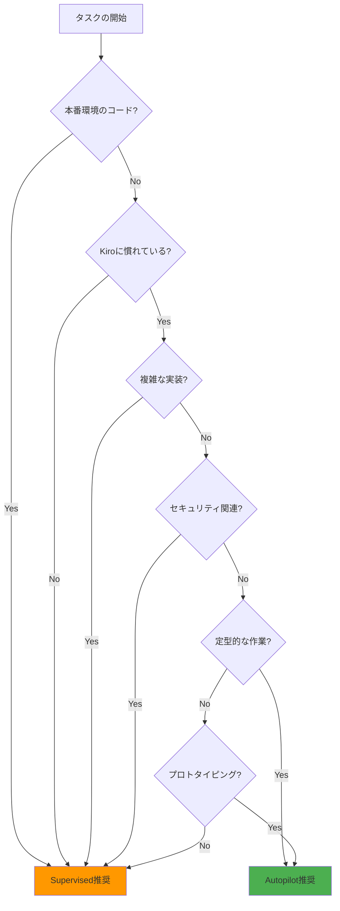

# Autonomy Modes（自律性モード）完全ガイド

## 概要

Kiroは2つの動作モード、**Autopilot（自動操縦）モード**と**Supervised（監督）モード**を提供します。これらのモードを適切に使い分けることで、開発スタイルや状況に応じた最適な開発体験を実現できます。

## Autopilot（自動操縦）モード

### 特徴

Autopilotモードでは、Kiroが自動的にファイルを修正し、変更を即座に適用します。開発者の承認を待たずに、AIが判断して実装を進めます。

**主な特徴：**
- ✅ 変更が即座に適用される
- ✅ 高速な開発サイクル
- ✅ 反復作業の効率化
- ✅ プロトタイピングに最適

### 適用場面

#### 推奨される使用シーン

1. **プロトタイピング**
   - 新しいアイデアの迅速な検証
   - MVPの素早い作成
   - 概念実証（PoC）の開発

2. **定型的な実装**
   - CRUD操作の実装
   - ボイラープレートコードの生成
   - 繰り返しパターンの実装

3. **信頼できるタスク**
   - 十分にテストされた機能の拡張
   - 既存パターンの踏襲
   - 単純なリファクタリング

4. **学習済みのプロジェクト**
   - Steeringファイルが充実しているプロジェクト
   - コーディング規約が明確なプロジェクト
   - パターンが確立されているプロジェクト

#### 使用例

```
# Autopilotモードでの開発例

「ユーザー一覧ページを作成してください。
既存のタスク一覧ページと同じパターンで実装してください。」

→ Kiroが自動的に以下を実行：
1. コンポーネントファイルの作成
2. APIエンドポイントの実装
3. ルーティングの設定
4. スタイルの適用
5. 基本的なテストの作成
```

### 注意点

⚠️ **重要な考慮事項：**

1. **バックアップの推奨**
   - 重要なファイルは事前にコミット
   - 大きな変更前にブランチを作成
   - 定期的なGitコミットを実施

2. **レビューの必要性**
   - 自動生成されたコードも必ずレビュー
   - セキュリティ面での検証を実施
   - パフォーマンスへの影響を確認

3. **適用範囲の制限**
   - 本番環境のコードには慎重に使用
   - クリティカルな機能には使用を避ける
   - 複雑なビジネスロジックには注意

## Supervised（監督）モード

### 特徴

Supervisedモードでは、変更前に開発者が確認・承認してから適用します。より慎重なアプローチで、学習機会も提供します。

**主な特徴：**
- ✅ 変更前に内容を確認できる
- ✅ 学習機会の提供
- ✅ より安全なアプローチ
- ✅ 重要な変更に適している

### 適用場面

#### 推奨される使用シーン

1. **学習段階**
   - Kiroに慣れるまでの期間
   - 新しい技術スタックの学習
   - プロジェクトの理解を深める段階

2. **重要な変更**
   - 本番環境のコード修正
   - セキュリティ関連の実装
   - データベーススキーマの変更
   - APIの破壊的変更

3. **複雑な実装**
   - 複雑なビジネスロジック
   - パフォーマンスクリティカルな処理
   - 複数のコンポーネントにまたがる変更

4. **チーム開発**
   - コードレビュー文化の維持
   - 知識共有の促進
   - 品質基準の統一

#### 使用例

```
# Supervisedモードでの開発例

「決済処理機能を実装してください。
セキュリティとエラーハンドリングを重視してください。」

→ Kiroが実装案を提示：
1. 実装内容の説明
2. セキュリティ考慮事項
3. エラーハンドリング戦略
4. テスト計画

→ 開発者が確認・承認
→ 承認後に実装を適用
```

### 利点

**学習効果：**
- AIの思考プロセスを理解できる
- ベストプラクティスを学べる
- コードレビュースキルが向上

**品質保証：**
- 意図しない変更を防げる
- セキュリティリスクを低減
- バグの早期発見

## モードの使い分け

### 判断基準

以下のフローチャートを参考に、適切なモードを選択してください：



### 実践的な使い分け例

#### シナリオ1: 新規プロジェクトの開始

```
フェーズ1（初期セットアップ）: Autopilot
- プロジェクト構造の作成
- 基本的な設定ファイル
- ボイラープレートコード

フェーズ2（コア機能実装）: Supervised
- 認証システム
- データベーススキーマ
- APIエンドポイント

フェーズ3（UI実装）: Autopilot
- 基本的なコンポーネント
- スタイリング
- ルーティング

フェーズ4（最適化）: Supervised
- パフォーマンス改善
- セキュリティ強化
- エラーハンドリング
```

#### シナリオ2: 既存プロジェクトの機能追加

```
調査フェーズ: Supervised
- 既存コードの理解
- 影響範囲の確認
- 設計の検討

実装フェーズ: Autopilot
- 新規ファイルの作成
- 定型的なコード生成
- テストの作成

統合フェーズ: Supervised
- 既存コードとの統合
- エッジケースの処理
- 最終レビュー
```

## モード切り替えのベストプラクティス

### 1. プロジェクト開始時の設定

```markdown
# プロジェクトのREADMEに記載

## Kiro使用ガイドライン

### Autopilotモード使用可能
- 新規コンポーネントの作成
- CRUDエンドポイントの実装
- スタイリングの適用
- 単体テストの作成

### Supervisedモード必須
- 認証・認可の実装
- データベーススキーマ変更
- 決済処理の実装
- 本番環境への変更
```

### 2. チーム開発での統一

```yaml
# .kiro/steering/development-guidelines.md
---
inclusion: always
---

# 開発ガイドライン

## Kiroモード使用基準

### Autopilotモード
- 経験豊富な開発者のみ使用可能
- 新規機能の初期実装に限定
- 必ず事後レビューを実施

### Supervisedモード
- 初心者は常にこのモードを使用
- セキュリティ関連は全員必須
- 本番環境への変更は必須
```

### 3. 段階的な移行

```
Week 1-2: Supervised のみ
- Kiroの動作を理解
- プロジェクトの構造を把握
- コーディング規約を学習

Week 3-4: 部分的にAutopilot
- 定型的なタスクでAutopilot試用
- 結果を必ずレビュー
- 問題があればSupervisedに戻す

Week 5+: 状況に応じて使い分け
- タスクの性質で判断
- チームの合意に基づく
- 継続的な改善
```

## トラブルシューティング

### Autopilotモードでの問題

#### 問題1: 意図しない変更が適用された

**対処法：**
```bash
# Gitで変更を確認
git diff

# 問題がある場合は元に戻す
git checkout -- <file>

# または、コミット全体を取り消す
git reset --hard HEAD~1
```

**予防策：**
- 小さな単位でタスクを分割
- 定期的にコミット
- 変更後は必ず動作確認

#### 問題2: 生成されたコードの品質が低い

**対処法：**
```
1. Steeringファイルでコーディング規約を明確化
2. より具体的な指示を提供
3. 一時的にSupervisedモードに切り替え
4. 生成後に手動でリファクタリング
```

### Supervisedモードでの問題

#### 問題1: 承認プロセスが遅い

**対処法：**
```
1. タスクをより小さく分割
2. 定型的な部分はAutopilotに切り替え
3. レビュー観点を事前に明確化
4. チーム内でレビュー基準を統一
```

#### 問題2: 学習曲線が急

**対処法：**
```
1. 簡単なタスクから始める
2. Kiroの提案を学習材料として活用
3. チーム内で知識を共有
4. 公式ドキュメントを参照
```

## パフォーマンス最適化

### Autopilotモードの最適化

```typescript
// 効率的なタスク分割
const tasks = [
  'ユーザーモデルの作成',
  'ユーザーリポジトリの実装',
  'ユーザーサービスの実装',
  'ユーザーコントローラーの実装',
  'ユーザーAPIのテスト作成'
];

// 各タスクを順次実行
for (const task of tasks) {
  // Autopilotで実行
  // 完了後、次のタスクへ
}
```

### Supervisedモードの最適化

```typescript
// バッチレビューの活用
const changes = [
  '複数のファイル変更',
  '関連するテストの追加',
  'ドキュメントの更新'
];

// まとめてレビュー
// 一括承認で効率化
```

## まとめ

Autonomy Modesの効果的な使い分けにより：

1. **開発速度の向上**: 適切なモード選択で効率的な開発
2. **品質の保証**: 重要な部分でのSupervisedモード使用
3. **学習効果**: Supervisedモードでの継続的な学習
4. **柔軟性**: 状況に応じた最適なモード選択

> 💡 **推奨アプローチ**: 初心者はSupervisedモードから始め、慣れてきたら徐々にAutopilotモードを活用していくことをお勧めします。

> 📖 **公式ドキュメント**: 最新の機能と詳細については [kiro.dev/docs](https://kiro.dev/docs/) を参照してください

---

## 📚 関連リソース

- [🏠 目次](../../README.md)
- [📖 Kiro基礎解説](../chapter1/kiro-introduction.md)
- [🛠️ トラブルシューティング](../troubleshooting/common-issues.md)
- [❓ FAQ](../troubleshooting/faq.md)
