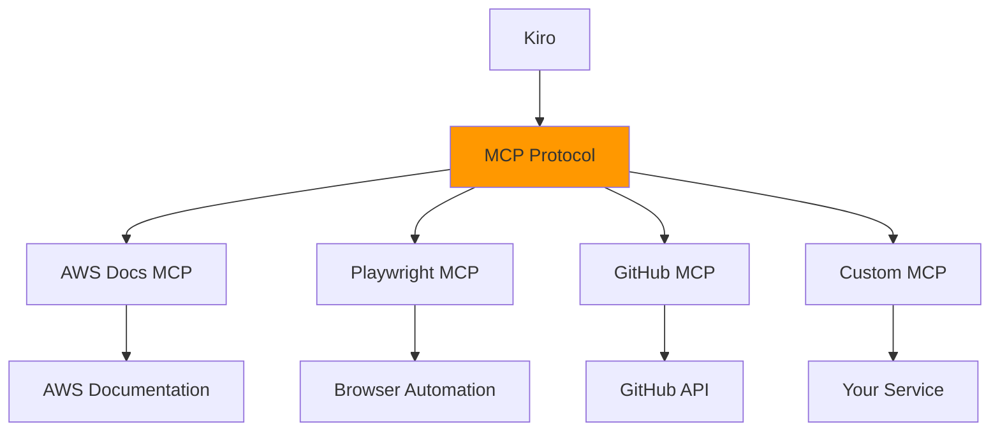

# MCP設定完全ガイド

## 概要

**MCP (Model Context Protocol)** は、Kiroと外部ツールやサービスを連携させるための標準プロトコルです。AWS Documentation、Playwright、GitHubなど、様々なサービスとKiroを統合できます。

## MCPの基本概念

### MCPとは

MCPは、AIモデルが外部のツールやデータソースにアクセスするための標準化されたプロトコルです。

**主な特徴:**
- 🔌 プラグイン形式で機能拡張
- 🔒 セキュアな通信
- 🚀 簡単なセットアップ
- 🌐 豊富なエコシステム

### MCPサーバーの種類



## MCP設定ファイル

### 設定ファイルの場所

Kiroは2つのレベルでMCP設定を管理します：

#### 1. ワークスペースレベル

```
.kiro/settings/mcp.json
```

**用途:**
- プロジェクト固有のMCPサーバー
- チーム全体で共有する設定
- Gitで管理される設定

#### 2. ユーザーレベル

```
~/.kiro/settings/mcp.json
```

**用途:**
- 個人的なMCPサーバー
- 複数プロジェクトで共通の設定
- 個人の認証情報を含む設定

### 設定のマージ

両方の設定ファイルが存在する場合：

```
最終設定 = ユーザーレベル設定 + ワークスペースレベル設定
```

**優先順位:**
- サーバー名が競合する場合、**ワークスペースレベルが優先**
- 期待されるMCPサーバーがワークスペースに定義されていない場合、ユーザーレベルで定義されている可能性がある

## 基本的な設定

### 設定ファイルの構造

```json
{
  "mcpServers": {
    "server-name": {
      "command": "実行コマンド",
      "args": ["引数のリスト"],
      "env": {
        "環境変数名": "値"
      },
      "disabled": false,
      "autoApprove": []
    }
  }
}
```

### 最小限の設定例

```json
{
  "mcpServers": {
    "aws-docs": {
      "command": "uvx",
      "args": ["awslabs.aws-documentation-mcp-server@latest"]
    }
  }
}
```

## uvxコマンドの使用

### uvxとは

`uvx`は、Pythonパッケージマネージャー`uv`に含まれるツールで、MCPサーバーの実行に使用します。

**重要な特徴:**
- ✅ パッケージを自動的にダウンロードして実行
- ✅ `uv`をインストールすれば自動的に使用可能
- ❌ `uvx install <package>`のようなコマンドは存在しない

### uvのインストール

```bash
# macOS / Linux
curl -LsSf https://astral.sh/uv/install.sh | sh

# Homebrew
brew install uv

# pip
pip install uv

# インストール確認
uv --version
uvx --version
```

### uvxの使用例

```json
{
  "mcpServers": {
    "aws-docs": {
      "command": "uvx",
      "args": [
        "awslabs.aws-documentation-mcp-server@latest"
      ]
    }
  }
}
```

## 詳細な設定オプション

### command（必須）

実行するコマンドを指定します。

```json
{
  "command": "uvx"
}
```

**一般的な値:**
- `"uvx"`: Python MCPサーバー
- `"node"`: Node.js MCPサーバー
- `"npx"`: npm パッケージ
- カスタムスクリプトのパス

### args（必須）

コマンドに渡す引数のリストです。

```json
{
  "args": [
    "awslabs.aws-documentation-mcp-server@latest"
  ]
}
```

**バージョン指定:**
```json
{
  "args": [
    "package-name@1.2.3"    // 特定バージョン
  ]
}

{
  "args": [
    "package-name@latest"   // 最新バージョン
  ]
}
```

### env（オプション）

環境変数を設定します。

```json
{
  "env": {
    "FASTMCP_LOG_LEVEL": "ERROR",
    "AWS_DOCUMENTATION_PARTITION": "aws",
    "API_KEY": "your-api-key"
  }
}
```

**一般的な環境変数:**
- `FASTMCP_LOG_LEVEL`: ログレベル（`ERROR`, `WARNING`, `INFO`, `DEBUG`）
- `AWS_REGION`: AWSリージョン
- `API_KEY`: APIキー
- `TIMEOUT`: タイムアウト時間

### disabled（オプション）

MCPサーバーの有効/無効を切り替えます。

```json
{
  "disabled": false  // 有効（デフォルト）
}

{
  "disabled": true   // 無効
}
```

**使用シーン:**
- 一時的にMCPサーバーを無効化
- デバッグ時の切り分け
- パフォーマンステスト

### autoApprove（オプション）

自動承認するツール名のリストです。

```json
{
  "autoApprove": []  // 全て手動承認（デフォルト）
}

{
  "autoApprove": [
    "read_documentation",
    "search_documentation"
  ]  // 指定したツールは自動承認
}
```

**セキュリティ考慮事項:**
- 読み取り専用のツールは自動承認しても安全
- 書き込みや実行を伴うツールは慎重に
- 本番環境では最小限に

## 主要なMCPサーバー設定例

### AWS Documentation MCP

```json
{
  "mcpServers": {
    "aws-docs": {
      "command": "uvx",
      "args": ["awslabs.aws-documentation-mcp-server@latest"],
      "env": {
        "FASTMCP_LOG_LEVEL": "ERROR",
        "AWS_DOCUMENTATION_PARTITION": "aws"
      },
      "disabled": false,
      "autoApprove": [
        "read_documentation",
        "search_documentation"
      ]
    }
  }
}
```

**利用可能なツール:**
- `read_documentation`: ドキュメントページの読み込み
- `search_documentation`: ドキュメントの検索
- `recommend`: コンテンツ推奨

**使用例:**
```
Amazon S3のベストプラクティスを教えてください。
```

### Playwright MCP

```json
{
  "mcpServers": {
    "playwright": {
      "command": "uvx",
      "args": ["mcp-server-playwright@latest"],
      "env": {
        "FASTMCP_LOG_LEVEL": "ERROR"
      },
      "disabled": false,
      "autoApprove": []
    }
  }
}
```

**利用可能なツール:**
- `navigate`: ページへの移動
- `click`: 要素のクリック
- `fill`: フォーム入力
- `screenshot`: スクリーンショット取得

**使用例:**
```
https://example.com にアクセスして、
ログインフォームのE2Eテストを作成してください。
```

### GitHub MCP

```json
{
  "mcpServers": {
    "github": {
      "command": "uvx",
      "args": ["mcp-server-github@latest"],
      "env": {
        "GITHUB_TOKEN": "${GITHUB_TOKEN}",
        "FASTMCP_LOG_LEVEL": "ERROR"
      },
      "disabled": false,
      "autoApprove": [
        "search_repositories",
        "get_file_contents"
      ]
    }
  }
}
```

**利用可能なツール:**
- `search_repositories`: リポジトリ検索
- `get_file_contents`: ファイル内容取得
- `create_issue`: Issue作成
- `create_pull_request`: PR作成

## 複数MCPサーバーの設定

### 基本的な複数設定

```json
{
  "mcpServers": {
    "aws-docs": {
      "command": "uvx",
      "args": ["awslabs.aws-documentation-mcp-server@latest"],
      "env": {
        "FASTMCP_LOG_LEVEL": "ERROR"
      }
    },
    "playwright": {
      "command": "uvx",
      "args": ["mcp-server-playwright@latest"],
      "env": {
        "FASTMCP_LOG_LEVEL": "ERROR"
      }
    },
    "github": {
      "command": "uvx",
      "args": ["mcp-server-github@latest"],
      "env": {
        "GITHUB_TOKEN": "${GITHUB_TOKEN}"
      }
    }
  }
}
```

### 環境別設定

```json
{
  "mcpServers": {
    "aws-docs-dev": {
      "command": "uvx",
      "args": ["awslabs.aws-documentation-mcp-server@latest"],
      "env": {
        "AWS_DOCUMENTATION_PARTITION": "aws",
        "FASTMCP_LOG_LEVEL": "DEBUG"
      },
      "disabled": false
    },
    "aws-docs-prod": {
      "command": "uvx",
      "args": ["awslabs.aws-documentation-mcp-server@latest"],
      "env": {
        "AWS_DOCUMENTATION_PARTITION": "aws",
        "FASTMCP_LOG_LEVEL": "ERROR"
      },
      "disabled": true
    }
  }
}
```

## MCPサーバーの管理

### 設定の反映

MCPサーバーの設定変更は自動的に反映されます：

1. **自動再接続**: 設定ファイル変更時に自動的に再接続
2. **手動再接続**: MCP Server viewから再接続可能
3. **Kiro再起動**: 通常は不要

### MCP Server Viewの使用

1. **MCP Server Viewを開く**
   - Kiro機能パネルの「MCP Server」ビューを開く

2. **サーバー状態の確認**
   - 接続状態（接続中/切断中）
   - 利用可能なツール一覧
   - エラーメッセージ

3. **サーバーの操作**
   - 再接続
   - 無効化/有効化
   - ログの確認

### コマンドパレットからの操作

```
Cmd/Ctrl + Shift + P → "MCP" で検索

利用可能なコマンド:
- MCP: Reconnect Server
- MCP: Show Server Logs
- MCP: Disable Server
- MCP: Enable Server
```

## MCPサーバーのテスト

### テストのベストプラクティス

> 💡 **公式推奨**: MCP設定後は、設定ファイルを確認する前に、直接ツールを試すのが推奨されます。

### 基本的なテスト方法

```
# ステップ1: MCPサーバーを設定
.kiro/settings/mcp.json に設定を追加

# ステップ2: 設定確認はスキップして直接テスト
Kiroのチャットで以下を試す:

「Amazon S3について教えてください」

# ステップ3: 動作確認
MCPが正常に動作していれば、
AWS Documentation MCPを使用して情報を取得します
```

### トラブルシューティング時のテスト

```
# 問題が発生した場合のみ設定を確認

# 1. 設定ファイルの構文確認
cat .kiro/settings/mcp.json | python -m json.tool

# 2. MCPサーバーの手動実行テスト
uvx awslabs.aws-documentation-mcp-server@latest

# 3. ログの確認
# MCP Server View → サーバーを選択 → ログを表示
```

## トラブルシューティング

### 問題1: MCPサーバーが起動しない

**症状:**
```
Error: Failed to start MCP server 'aws-docs'
```

**解決方法:**

```bash
# 1. uvとuvxのインストール確認
uv --version
uvx --version

# インストールされていない場合
curl -LsSf https://astral.sh/uv/install.sh | sh
source ~/.bashrc  # または ~/.zshrc

# 2. MCPサーバーの手動実行テスト
uvx awslabs.aws-documentation-mcp-server@latest

# 3. 設定ファイルの構文確認
python -m json.tool .kiro/settings/mcp.json
```

### 問題2: ツールが認識されない

**症状:** AWS関連のツールが利用できない

**解決方法:**

```json
// 1. autoApproveリストを確認
{
  "autoApprove": [
    "read_documentation",  // ツール名が正しいか確認
    "search_documentation"
  ]
}

// 2. サーバーが有効か確認
{
  "disabled": false  // trueになっていないか確認
}

// 3. MCP Server Viewで状態確認
// - 接続状態
// - 利用可能なツール一覧
// - エラーメッセージ
```

### 問題3: 応答が遅い

**症状:** MCP情報の取得に時間がかかる

**解決方法:**

```json
{
  "env": {
    // ログレベルを下げる
    "FASTMCP_LOG_LEVEL": "ERROR",  // DEBUGやINFOから変更
    
    // タイムアウトを設定
    "TIMEOUT": "30000"  // 30秒
  }
}
```

### 問題4: 権限エラー

**症状:** MCPサーバーの実行権限がない

**解決方法:**

```bash
# 1. 実行権限の確認
which uvx
ls -la $(which uvx)

# 2. パスの確認
echo $PATH

# 3. 必要に応じてパスを追加
export PATH="$HOME/.local/bin:$PATH"

# 4. シェル設定ファイルに追加
echo 'export PATH="$HOME/.local/bin:$PATH"' >> ~/.zshrc
source ~/.zshrc
```

## カスタムMCPサーバーの作成

### 基本的な構造

```python
# custom_mcp_server.py
from fastmcp import FastMCP

mcp = FastMCP("Custom MCP Server")

@mcp.tool()
def custom_tool(param: str) -> str:
    """カスタムツールの説明"""
    # ツールの実装
    return f"Result: {param}"

if __name__ == "__main__":
    mcp.run()
```

### Kiroでの設定

```json
{
  "mcpServers": {
    "custom-server": {
      "command": "python",
      "args": ["/path/to/custom_mcp_server.py"],
      "env": {
        "CUSTOM_ENV_VAR": "value"
      }
    }
  }
}
```

## ベストプラクティス

### 1. 設定の分離

```json
// ワークスペース設定（.kiro/settings/mcp.json）
// プロジェクト固有、チーム共有
{
  "mcpServers": {
    "aws-docs": {
      "command": "uvx",
      "args": ["awslabs.aws-documentation-mcp-server@latest"]
    }
  }
}

// ユーザー設定（~/.kiro/settings/mcp.json）
// 個人用、認証情報を含む
{
  "mcpServers": {
    "github": {
      "command": "uvx",
      "args": ["mcp-server-github@latest"],
      "env": {
        "GITHUB_TOKEN": "ghp_your_personal_token"
      }
    }
  }
}
```

### 2. セキュリティ

```json
{
  "mcpServers": {
    "secure-server": {
      "command": "uvx",
      "args": ["secure-mcp-server@latest"],
      "env": {
        // 環境変数から読み込む
        "API_KEY": "${API_KEY}",
        
        // ハードコードしない
        // "API_KEY": "actual-key-value"  // ❌ 危険
      },
      // 読み取り専用ツールのみ自動承認
      "autoApprove": [
        "read_data",
        "search_data"
      ]
      // 書き込みツールは手動承認
    }
  }
}
```

### 3. パフォーマンス

```json
{
  "mcpServers": {
    "optimized-server": {
      "command": "uvx",
      "args": ["mcp-server@latest"],
      "env": {
        // ログレベルを最小限に
        "FASTMCP_LOG_LEVEL": "ERROR",
        
        // タイムアウトを適切に設定
        "TIMEOUT": "10000",
        
        // キャッシュを有効化
        "ENABLE_CACHE": "true"
      }
    }
  }
}
```

### 4. ドキュメント化

```json
{
  "mcpServers": {
    "documented-server": {
      // 目的を明記
      "_comment": "AWS Documentation MCP - AWSサービスの情報取得用",
      
      "command": "uvx",
      "args": ["awslabs.aws-documentation-mcp-server@latest"],
      "env": {
        "FASTMCP_LOG_LEVEL": "ERROR"
      },
      
      // 利用可能なツールを記載
      "_tools": [
        "read_documentation",
        "search_documentation",
        "recommend"
      ]
    }
  }
}
```

## まとめ

MCP設定の効果的な活用により：

1. **機能拡張**: 外部サービスとのシームレスな統合
2. **効率化**: 必要な情報への迅速なアクセス
3. **柔軟性**: プロジェクトに応じたカスタマイズ
4. **セキュリティ**: 適切な権限管理

> 💡 **推奨アプローチ**: まず公式MCPサーバーから始めて、必要に応じてカスタムMCPサーバーを作成することをお勧めします。

> 📖 **公式ドキュメント**: 最新の機能と詳細については [kiro.dev/docs](https://kiro.dev/docs/) を参照してください

---

## 📚 関連リソース

- [🏠 目次](../../README.md)
- [📖 Kiro基礎解説](../chapter1/kiro-introduction.md)
- [⚙️ AWS MCP設定](../chapter2/aws-mcp-setup.md)
- [🧪 Playwright MCPテスト](../chapter1/playwright-mcp-testing.md)
- [📁 MCP設定テンプレート](../../templates/mcp/)
- [🛠️ トラブルシューティング](../troubleshooting/common-issues.md)
