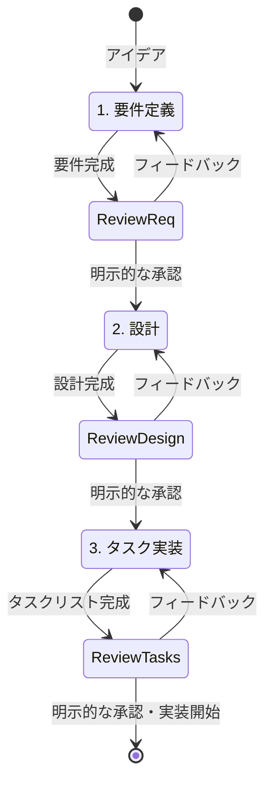
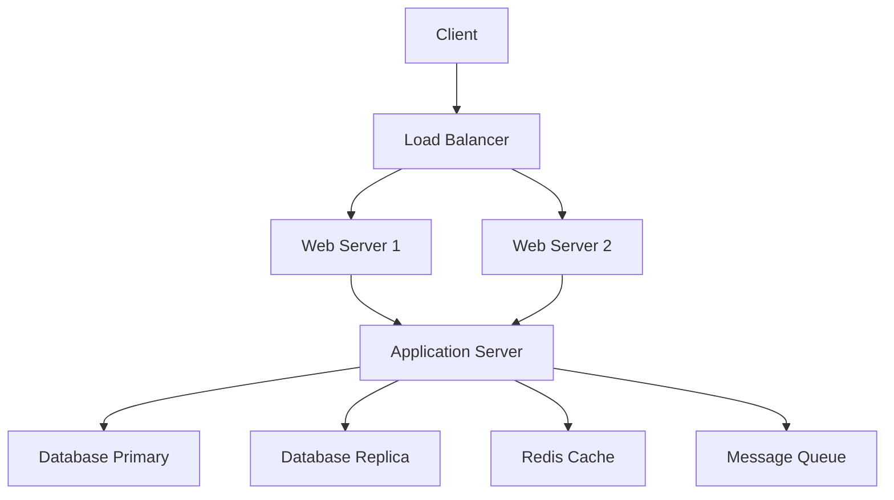
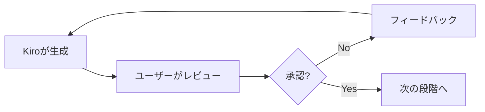

# Specsワークフロー完全ガイド

## 概要

**Specs（スペック）**は、複雑な機能を体系的に開発するためのKiroの構造化されたワークフローです。要件定義、設計、タスク実装の3段階を経て、反復的に改善しながら高品質なソフトウェアを開発できます。

## Specsの基本概念

### なぜSpecsを使うのか

従来の開発では：
- 要件が曖昧なまま実装を開始
- 設計とコードが乖離
- 手戻りが多く発生
- チーム内での認識のずれ

Specsを使うと：
- ✅ 要件が明確になってから実装開始
- ✅ 設計とコードの一貫性を保持
- ✅ 段階的なレビューで手戻りを削減
- ✅ チーム全体での認識統一

### Specsの3段階



## 第1段階: 要件定義（Requirements）

### ファイル構造

```
.kiro/specs/{feature_name}/
└── requirements.md
```

### 要件ドキュメントの構成

```markdown
# Requirements Document

## Introduction
機能の概要と目的

## Requirements

### Requirement 1

**User Story:** 
As a [role], I want [feature], so that [benefit]

#### Acceptance Criteria

1. WHEN [event] THEN [system] SHALL [response]
2. IF [precondition] THEN [system] SHALL [response]
3. WHEN [event] AND [condition] THEN [system] SHALL [response]

### Requirement 2
...
```

### EARS形式の詳細

**EARS (Easy Approach to Requirements Syntax)** は、要件を明確に記述するための構文です。

#### 基本パターン

1. **Ubiquitous (遍在的)**
   ```
   The system SHALL [action]
   
   例: The system SHALL encrypt all user passwords
   ```

2. **Event-driven (イベント駆動)**
   ```
   WHEN [trigger] THEN the system SHALL [response]
   
   例: WHEN a user clicks the submit button THEN the system SHALL validate the form
   ```

3. **State-driven (状態駆動)**
   ```
   WHILE [state] the system SHALL [action]
   
   例: WHILE the user is logged in the system SHALL display the dashboard
   ```

4. **Optional (オプション)**
   ```
   WHERE [feature is included] the system SHALL [action]
   
   例: WHERE premium subscription is active the system SHALL enable advanced features
   ```

5. **Unwanted (望ましくない動作)**
   ```
   IF [condition] THEN the system SHALL [preventive action]
   
   例: IF invalid credentials are provided THEN the system SHALL reject the login attempt
   ```

### 要件作成のプロセス

#### ステップ1: Kiroに初期要件を生成させる

```
新しい機能のSpecを作成したいです。

機能名: ユーザー認証システム

概要:
- ユーザー登録機能
- ログイン/ログアウト機能
- パスワードリセット機能
- セッション管理

要件ドキュメントを作成してください。
```

#### ステップ2: レビューとフィードバック

Kiroが要件を生成したら、以下の観点でレビュー：

- [ ] ユーザーストーリーは明確か
- [ ] 受け入れ基準は具体的か
- [ ] エッジケースが考慮されているか
- [ ] セキュリティ要件が含まれているか
- [ ] パフォーマンス要件が明記されているか

#### ステップ3: 反復的な改善

```
要件を確認しました。以下の点を追加してください：

1. 2要素認証のサポート
2. ソーシャルログイン（Google、GitHub）
3. アカウントロック機能（不正ログイン試行時）
4. パスワード強度の要件
```

#### ステップ4: 明示的な承認

```
要件を確認しました。承認します。
設計フェーズに進んでください。
```

> ⚠️ **重要**: 「はい」「承認」「良いです」などの明示的な承認が必要です。曖昧な返答では次の段階に進みません。

### 要件定義のベストプラクティス

#### 1. 具体的で測定可能な基準

```
# 悪い例
The system SHALL be fast

# 良い例
WHEN a user submits a search query THEN the system SHALL return results within 2 seconds for 95% of requests
```

#### 2. 優先順位の明確化

```markdown
### Requirement 1 (Priority: High)
**User Story:** As a user, I want to log in securely...

### Requirement 2 (Priority: Medium)
**User Story:** As a user, I want to reset my password...

### Requirement 3 (Priority: Low)
**User Story:** As a user, I want to customize my profile...
```

#### 3. 制約条件の明記

```markdown
## Constraints

### Technical Constraints
- Must support browsers: Chrome 90+, Firefox 88+, Safari 14+
- Must work on mobile devices (iOS 14+, Android 10+)
- Must integrate with existing OAuth2 provider

### Business Constraints
- Development timeline: 6 weeks
- Budget: $50,000
- Team size: 3 developers

### Regulatory Constraints
- Must comply with GDPR
- Must comply with CCPA
- Must implement data retention policies
```

## 第2段階: 設計（Design）

### ファイル構造

```
.kiro/specs/{feature_name}/
├── requirements.md
└── design.md
```

### 設計ドキュメントの構成

```markdown
# Design Document

## Overview
設計の全体像

## Architecture
システムアーキテクチャ

## Components and Interfaces
コンポーネント設計

## Data Models
データモデル

## Error Handling
エラー処理戦略

## Testing Strategy
テスト戦略
```

### 設計作成のプロセス

#### ステップ1: Kiroに設計を生成させる

```
要件に基づいて設計ドキュメントを作成してください。

技術スタック:
- Frontend: React + TypeScript
- Backend: Node.js + Express
- Database: PostgreSQL
- Authentication: JWT

以下を含めてください:
- システムアーキテクチャ図
- データベーススキーマ
- API設計
- セキュリティ考慮事項
```

#### ステップ2: 設計のレビュー

レビュー観点：

- [ ] アーキテクチャは要件を満たしているか
- [ ] スケーラビリティは考慮されているか
- [ ] セキュリティは適切か
- [ ] パフォーマンスは最適か
- [ ] 保守性は高いか
- [ ] テスト可能な設計か

#### ステップ3: 詳細化の依頼

```
設計を確認しました。以下の点を詳細化してください：

1. データベーススキーマにインデックス設計を追加
2. API設計にレート制限の仕様を追加
3. エラーハンドリングに具体的なエラーコードを定義
4. セキュリティにCSRF対策を追加
```

#### ステップ4: 明示的な承認

```
設計を承認します。
タスク分割フェーズに進んでください。
```

### 設計のベストプラクティス

#### 1. 図解の活用

```markdown
## System Architecture


```

#### 2. 具体的なコード例

```markdown
## Authentication Flow

```typescript
interface AuthService {
  login(credentials: LoginCredentials): Promise<AuthToken>;
  logout(token: string): Promise<void>;
  refreshToken(refreshToken: string): Promise<AuthToken>;
  validateToken(token: string): Promise<boolean>;
}

class JWTAuthService implements AuthService {
  async login(credentials: LoginCredentials): Promise<AuthToken> {
    // Implementation
  }
}
```
```

#### 3. トレードオフの明記

```markdown
## Design Decisions

### Decision 1: JWT vs Session-based Authentication

**Chosen:** JWT

**Rationale:**
- Pros: Stateless, scalable, works well with microservices
- Cons: Cannot revoke tokens easily, larger payload size

**Alternatives Considered:**
- Session-based: Better for token revocation but requires shared state
- OAuth2: Too complex for current requirements

**Mitigation:**
- Implement short-lived access tokens (15 minutes)
- Use refresh tokens for long-term sessions
- Maintain token blacklist for critical revocations
```

## 第3段階: タスク分割・実装（Tasks）

### ファイル構造

```
.kiro/specs/{feature_name}/
├── requirements.md
├── design.md
└── tasks.md
```

### タスクリストの構成

```markdown
# Implementation Plan

- [ ] 1. プロジェクト基盤の構築
  - プロジェクト構造の作成
  - 依存関係のインストール
  - 基本設定ファイルの作成
  - _Requirements: 1.1, 1.2_

- [ ] 2. データモデルの実装
- [ ] 2.1 User モデルの作成
  - TypeScript型定義
  - バリデーション関数
  - _Requirements: 2.1, 2.2_

- [ ]* 2.2 ユニットテストの作成
  - User モデルのテスト
  - バリデーションのテスト
  - _Requirements: 2.1_

- [ ] 3. 認証APIの実装
...
```

### タスクの特徴

#### 階層構造

- **最大2レベル**: 親タスクとサブタスク
- **番号付け**: 1, 1.1, 1.2, 2, 2.1...
- **チェックボックス**: 進捗管理

#### オプションタスク

`*`マークでオプションタスクを示す：

```markdown
- [ ] 2. データモデルの実装
- [ ] 2.1 コア実装
  - 必須の実装
  - _Requirements: 2.1_

- [ ]* 2.2 ユニットテスト
  - テストコード（オプション）
  - _Requirements: 2.1_
```

> 💡 **オプションタスクの扱い**: `*`マークのタスクはMVP開発時にスキップ可能です。コア機能に集中したい場合に活用します。

#### 要件参照

各タスクは要件を参照：

```markdown
- [ ] 1.1 ユーザー登録APIの実装
  - POST /api/auth/register エンドポイント
  - バリデーション処理
  - パスワードハッシュ化
  - _Requirements: 1.1, 1.2, 3.1_
```

### タスク作成のプロセス

#### ステップ1: Kiroにタスクリストを生成させる

```
設計に基づいてタスクリストを作成してください。

要件:
- 各タスクは1-3日で完了可能な単位
- テスト駆動開発を推奨
- 段階的にリリース可能な構成
- 依存関係を明確に

優先順位:
1. 認証機能（必須）
2. ユーザー管理（重要）
3. プロフィール機能（低優先度）
```

#### ステップ2: タスクのレビュー

レビュー観点：

- [ ] タスクサイズは適切か
- [ ] 依存関係は明確か
- [ ] 要件カバレッジは十分か
- [ ] テストタスクは含まれているか
- [ ] 段階的リリースが可能か

#### ステップ3: 調整の依頼

```
タスクリストを確認しました。以下の調整をお願いします：

1. タスク2.1が大きすぎるので、2つに分割してください
2. タスク3にデータベースマイグレーションを追加してください
3. E2Eテストのタスクを追加してください
```

#### ステップ4: 明示的な承認

```
タスクリストを承認します。
実装を開始できます。
```

### タスク実装の方法

#### 方法1: tasks.mdから直接実行

1. `tasks.md`ファイルを開く
2. 各タスクの横にある「Start task」ボタンをクリック
3. Kiroが1つのタスクを実装
4. 完了後、次のタスクへ進む

#### 方法2: チャットで指定

```
タスク2.1「User モデルの作成」を実装してください。
```

#### 方法3: 複数タスクの一括実行

```
タスク2（データモデルの実装）の
全サブタスクを順番に実装してください。
```

### タスク実装のベストプラクティス

#### 1. 1タスクずつ実装

```
# 推奨
タスク1を実装 → レビュー → タスク2を実装 → レビュー

# 非推奨
タスク1-5を一気に実装 → まとめてレビュー
```

#### 2. テストを含める

```markdown
- [ ] 2. ユーザー登録機能
- [ ] 2.1 実装
  - API エンドポイント
  - バリデーション
  - データベース保存

- [ ] 2.2 テスト
  - 正常系テスト
  - 異常系テスト
  - エッジケーステスト
```

#### 3. 段階的な統合

```markdown
- [ ] 1. 基本機能の実装
- [ ] 2. 単体テストの実行
- [ ] 3. 統合テストの実行
- [ ] 4. 他機能との統合
- [ ] 5. E2Eテストの実行
```

## 反復的な改善プロセス

### 各段階でのフィードバックループ



### フィードバックの例

#### 要件段階

```
要件を確認しました。以下の点を修正してください：

1. Requirement 2の受け入れ基準が曖昧です
   → 具体的な数値基準を追加してください

2. セキュリティ要件が不足しています
   → OWASP Top 10への対応を追加してください

3. パフォーマンス要件を追加してください
   → レスポンス時間の目標値を設定してください
```

#### 設計段階

```
設計を確認しました。以下の点を改善してください：

1. データベーススキーマにインデックスが不足
   → 頻繁に検索されるカラムにインデックスを追加

2. エラーハンドリングが不十分
   → 各エラーケースの処理方法を明確化

3. キャッシュ戦略を追加
   → Redisを使用したキャッシュ設計を追加
```

#### タスク段階

```
タスクリストを確認しました。以下を調整してください：

1. タスク3が大きすぎます
   → 3.1, 3.2, 3.3に分割してください

2. デプロイメントタスクが不足
   → Docker設定とCI/CD設定のタスクを追加

3. ドキュメント作成タスクを追加
   → API ドキュメントとREADME更新のタスクを追加
```

## トラブルシューティング

### 問題1: 承認しても次に進まない

**原因**: 曖昧な承認表現

**解決方法**:
```
# 曖昧な表現（NG）
「いいと思います」
「概ね問題ないです」
「進めてください」

# 明示的な承認（OK）
「承認します」
「はい、承認します」
「良いです。次に進んでください」
```

### 問題2: 生成された内容が期待と異なる

**原因**: 指示が不明確

**解決方法**:
```
# 不明確な指示
「ユーザー機能を作りたい」

# 明確な指示
「ユーザー機能のSpecを作成したいです。

含める機能:
- ユーザー登録（メール認証付き）
- ログイン/ログアウト
- プロフィール編集
- パスワード変更

技術要件:
- JWT認証
- PostgreSQLデータベース
- RESTful API

セキュリティ要件:
- パスワードハッシュ化（bcrypt）
- CSRF対策
- レート制限」
```

### 問題3: タスクが大きすぎる

**原因**: 分割が不十分

**解決方法**:
```
タスク2が大きすぎます。
以下のように分割してください：

- [ ] 2. ユーザー管理機能
- [ ] 2.1 データモデルの作成
- [ ] 2.2 リポジトリ層の実装
- [ ] 2.3 サービス層の実装
- [ ] 2.4 コントローラー層の実装
- [ ] 2.5 APIエンドポイントの実装
- [ ]* 2.6 ユニットテストの作成
```

## 高度な活用方法

### 1. 既存Specの更新

```
既存のユーザー認証Specを更新したいです。

追加機能:
- 2要素認証
- ソーシャルログイン

requirements.mdに追加要件を記載してください。
```

### 2. Specの分割

```
現在のSpecが大きくなりすぎました。
以下のように分割してください：

1. user-authentication (認証機能)
2. user-profile (プロフィール機能)
3. user-settings (設定機能)

各Specに適切に要件を振り分けてください。
```

### 3. Specの統合

```
以下の2つのSpecを統合したいです：

- user-management
- user-permissions

統合後のSpec名: user-system

要件、設計、タスクを統合してください。
```

## まとめ

Specsワークフローの効果的な活用により：

1. **明確な要件**: EARS形式による具体的な要件定義
2. **体系的な設計**: 包括的な設計ドキュメント
3. **実装可能なタスク**: 小さく管理しやすいタスク分割
4. **反復的改善**: 各段階でのレビューとフィードバック
5. **品質保証**: 段階的な検証による高品質な実装

> 💡 **成功の鍵**: 各段階で明示的な承認を行い、急がず丁寧にレビューすることが重要です。

> 📖 **公式ドキュメント**: 最新の機能と詳細については [kiro.dev/docs](https://kiro.dev/docs/) を参照してください

---

## 📚 関連リソース

- [🏠 目次](../../README.md)
- [📖 Kiro基礎解説](../chapter1/kiro-introduction.md)
- [🎮 テトリス作成チュートリアル](../chapter1/tetris-tutorial.md)
- [🚀 本格的なアプリ開発](../chapter2/design-review-implementation.md)
- [🛠️ トラブルシューティング](../troubleshooting/common-issues.md)
